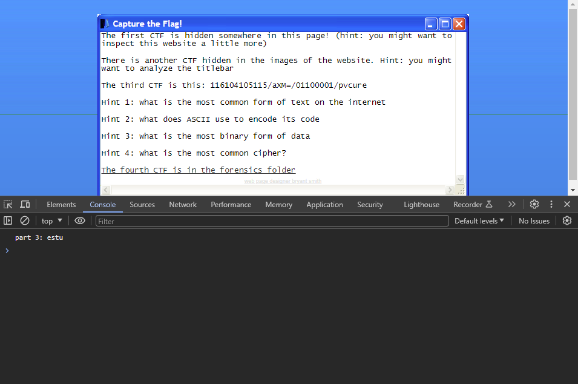

# CTF Module 1
solution: websitesarestupendous

stage 1: The website says i should "inspect" the website. maybe i should inspect element?

bingo! we found the first part of the key

stage 2: the hint says that we should check the "style" of the page. maybe we should add style sheets?

shazam! we found the second part of the key

stage 3: the hint talks about something about scripts. maybe hes talking about javascript? lets read the javascript console real quick

abracadabra! we found the third part of the key

stage 4: the javascript file itself talks about a README. maybe we should look for a common file in github pages, README.md?

alakazam! we found the fourth part of the key

# CTF Module 2
Solution: steganographyisreallycool

Stage 1: the first hint says we should analyze the titlebar, and the webite inspect element lets us download something called titlebar.png

maybe we should put it through a steganography analyzer?

ta-da! we found the first part of the key

Stage 2: the hint says we should find the back most part of a website, maybe hes talking about the background?

ok, lets put it into the stego inspector

shazam! we found the second part of the key

Stage 3: the hint talks about foot and feet, maybe hes talking about the footer?

ok, lets download the footer and analyze it

open sesame! we found the third part of the key

Stage 4: if i highlight the page, there seems to be some part 4 code hidden in the webpage

horse and hattock! we found the fourth part of the key

# CTF Module 3
Solution: thisisacipher

Stage 1: the first part looks like a bunch of numbers, what is the most common use of text, however?

It seems to be ASCII, maybe the code were using is ASCII?

hocus-pocus! we found the first part of the key

Stage 2: the next part looks like base64, maybe the code is base64?

presto-chango! we found the second part of the key

Stage 3: the hint talks about binary, maybe this part of the cypher is ASCII in binary?

presto! we found the third part of the key

Stage 4: the hint talks about the most common cipher, maybe we should look that up?

ok so the most common cipher is rot13, maybe the cipher is rot13?

voila! we found the fourth part of the key

# CTF Module 4

Solution: i54c2f14206b28a253d31c453e2716971digitalforensics

Stage 1: the first part gives us a link to a zip and and we open it to find some files 

one of the files contains the first code! wow!

Stage 2: the next hint talks about something about md5 hash? maybe I should open the file called md5 hash

ok, so the hash of the file is the second part of the code? ahhah1!

Stage 3: the hint talks about how the hash is a password, and one of the files is a password prottected zip file. hm.

ok! we found the third part of the key

Stage 4: the last hint asks us what the parent folder is called, is it forensics?

yup!